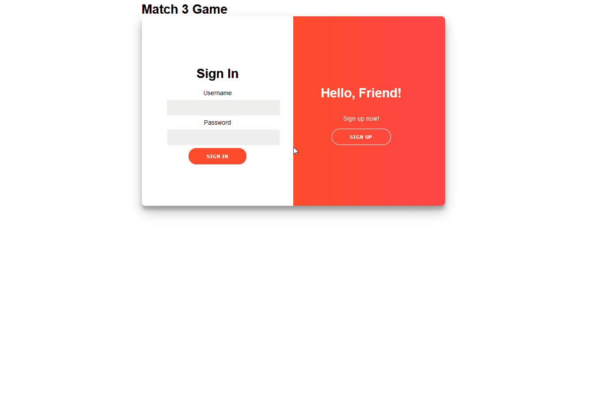
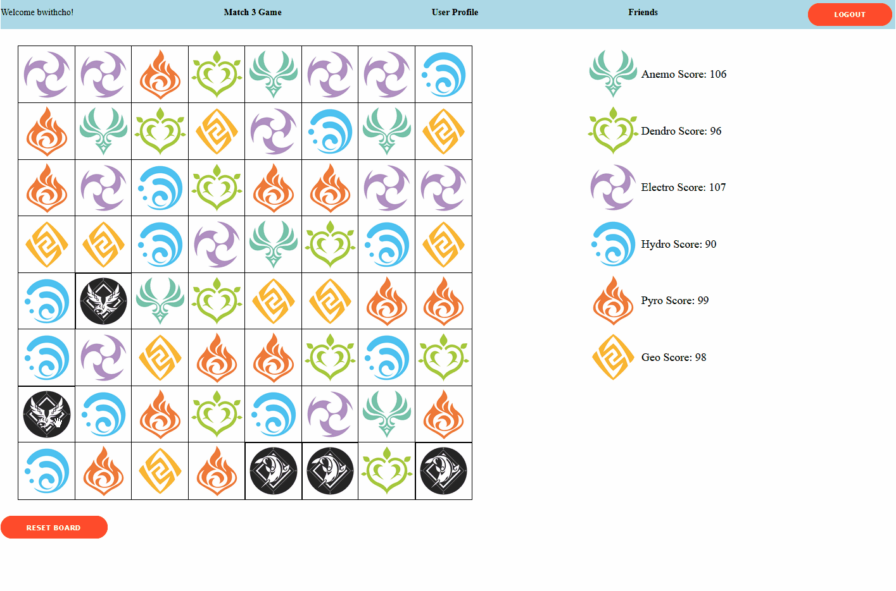
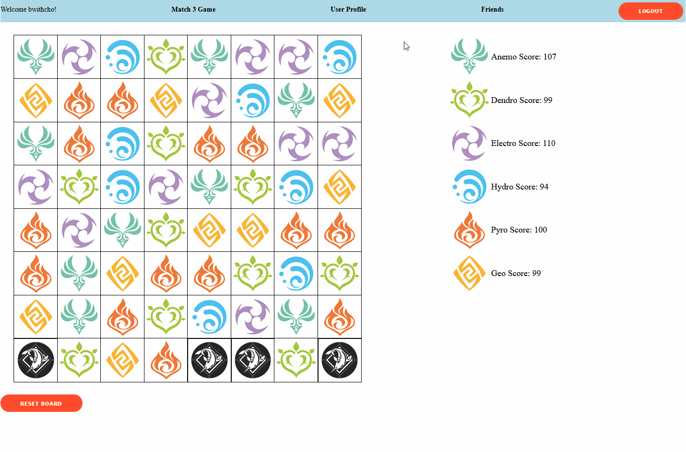
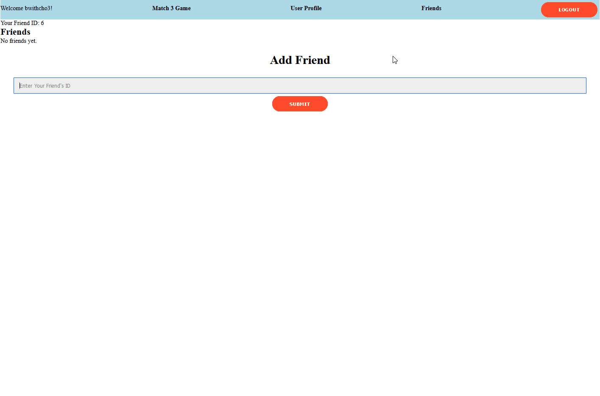

# Match 3 Game

## Description
Signup for an account or log in to start playing!

Match pieces together to increase your score!

Get achievements based on your score!

Add your friends!

## Starting Up

You can use the following commands to run the application:

- `rails s`: run the backend on [http://localhost:3000](http://localhost:3000)
- `npm start --prefix client`: run the frontend on
  [http://localhost:4000](http://localhost:4000)

